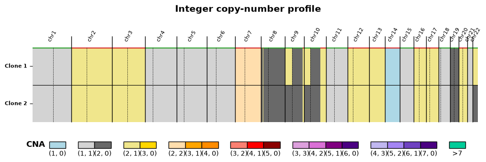
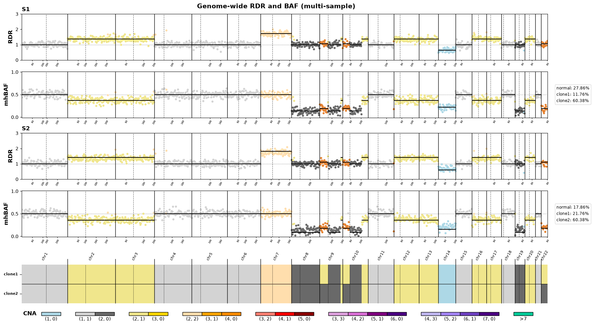
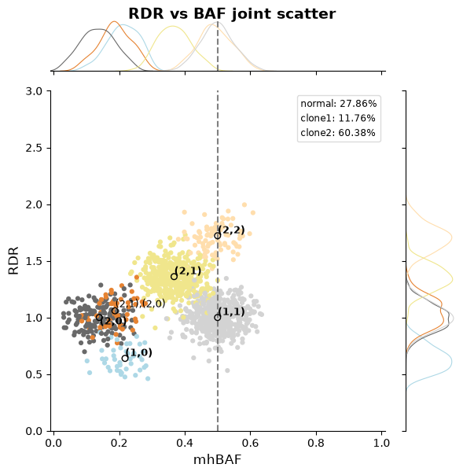
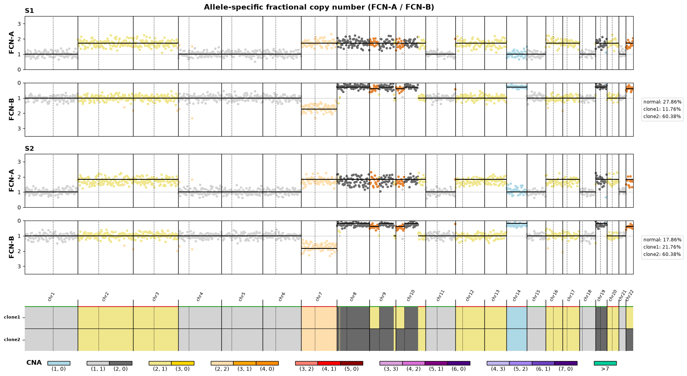
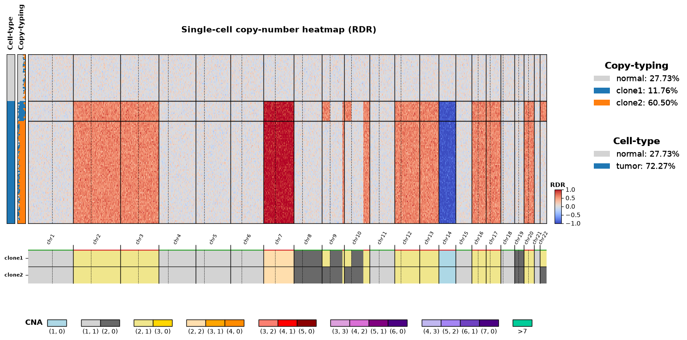
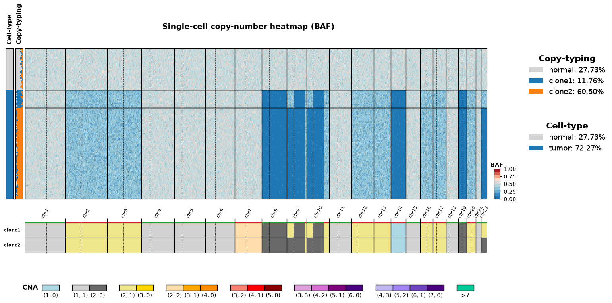

# CN-Plot

[](https://github.com/raphael-group/cnplot/releases)

`cnplot` is an allele-specific copy-number profile visualization python package implemented based on matplotlib. This package is developed for the purpose of easily and beautifully plotting copy-number profiles as well as read-depth ratio, B-allele frequency (and others) observations across multiple samples with a common reference coordinates with both single-cell and (pseudo-)bulk option.


## Installation
`Python >=3.10` is required for installation.
### Install PyPI package:
```sh
pip install cnplot
```

### Install from source:
```sh
git clone https://github.com/raphael-group/cnplot.git
cd cnplot
pip install -e ".[dev]"
```

## API Usage
See **[docs/reference.md](docs/reference.md)** for detailed descriptions. Every figure below is
produced by [`examples/plot_gallery.py`](examples/plot_gallery.py), which loads the example files
in [`tests/data`](tests/data).

### 0. Build the coordinate axis
We build a common genome coordinate axis from the reference, shared by every figure below.
Reference: [`region_bed`](docs/reference.md#region_bed), [`chrom_sizes`](docs/reference.md#chrom_sizes).

```python
from cnplot import GenomeAxis

genome_axis = GenomeAxis("regions.bed", "chrom.sizes")
```

### 1. Integer copy-number profile
We plots the integer allele-specific copy-number profiles over 2 tumor clones.
Reference: [`seg_df`](docs/reference.md#seg_df-hatchet-style-segucn-profile).

```python
import pandas as pd
import matplotlib.pyplot as plt
from cnplot import plot_cnv_profile

seg_df = pd.read_table("sample.seg.ucn.tsv")

fig, (ax, ax_leg) = plt.subplots(2, 1, figsize=(12, 3), height_ratios=[3, 1])
plot_cnv_profile(ax, seg_df, genome_axis, sample_id="S1", ax_leg=ax_leg,
                 title="Integer copy-number profile")
fig.savefig("profile.png", bbox_inches="tight")   # returns None; you own the figure
```



### 2. Genome-wide RDR and BAF (multi-sample)
We plots the per-bin read-depth ratio (RDR) and B-allele frequency (BAF) for both samples over the shared clonal profile.
Reference: [`obs_df`](docs/reference.md#obs_df-bin-level-observations), [`expected_df` (1D)](docs/reference.md#expected_df-1d-overlay).

```python
from cnplot import get_mixcn_cmap, make_row_spec, plot_scatter_1d_multisample

obs_df = pd.read_table("sample.bbc.ucn.tsv")
expected_1d = pd.read_table("sample.expected1d.tsv")

# subclonal-aware CNP color palette
clones = [c[3:] for c in seg_df.columns if c.startswith("cn_")]
obs_df["cnp"] = obs_df[[f"cn_{c}" for c in clones]].agg(";".join, axis=1)
palette = get_mixcn_cmap(obs_df["cnp"].unique())

rows = [
    make_row_spec("RD", ylabel="RDR", ylim=(0, 3), href=1.0),
    make_row_spec("BAF", ylabel="mhBAF", ylim=(-0.05, 1.05), href=0.5),
]
fig = plot_scatter_1d_multisample(
    obs_df, genome_axis, row_specs=rows, groups=["S1", "S2"],
    expected_df=expected_1d, hue="cnp", palette=palette, seg_df=seg_df,
)
fig.suptitle("Genome-wide RDR and BAF", fontweight="bold")
```



### 3. RDR vs BAF joint scatter
We plots the joint RDR-vs-BAF scatter for one sample, with the expected copy-number states drawn as landmarks.
Reference: [`expected_df` (2D)](docs/reference.md#expected_df-2d-landmarks).

```python
from cnplot import plot_scatter_2d

expected_2d = pd.read_table("sample.expected2d.tsv")
grid = plot_scatter_2d(
    obs_df, "BAF", "RD", expected_df=expected_2d, group="S1",
    hue="cnp", palette=palette, title="RDR vs BAF joint scatter",
    xlim=(0, 1), ylim=(0, 3), xlabel="mhBAF", ylabel="RDR",
)
```



### 4. Allele-specific fractional copy number (FCN-A / FCN-B)
We plots the allele-specific fractional copy numbers, the A allele (FCN-A) above and the B allele (FCN-B) mirrored below.
Reference: [`expected_df` (1D)](docs/reference.md#expected_df-1d-overlay).

```python
rows = [
    make_row_spec("FCN-A", ylabel="FCN-A", ylim=(0, 3.5), href=1.0),
    make_row_spec("FCN-B", ylabel="FCN-B", ylim=(0, 3.5), href=1.0, reverse_y=True),
]
fig = plot_scatter_1d_multisample(
    obs_df, genome_axis, row_specs=rows, groups=["S1", "S2"],
    expected_df=expected_1d, hue="cnp", palette=palette, seg_df=seg_df,
)
fig.suptitle("Allele-specific fractional copy number", fontweight="bold")
```



### 5. Single-cell copy-number heatmap
We plots a per-cell RDR/BAF heatmap with copy-typing-posterior and cell-type side strips over the clonal profile, shown below for RDR and BAF.
Reference: [Heatmap inputs](docs/reference.md#heatmap-inputs), [strip specs](docs/reference.md#strip-specs-entries-of-strips).

```python
import numpy as np
from cnplot import get_log2rdr_cmap, get_multiclass_cmap, plot_heatmap_cnp

matrix = np.loadtxt("heatmap.rdr.tsv.gz", delimiter="\t")        # (n_cells, n_bins) log2 RDR
bins = obs_df.query("SAMPLE == 'S1'")[["#CHR", "START", "END"]]   # matrix columns
cells = pd.read_table("cell_posteriors.tsv")                     # per-cell label + posterior
cell_labels = cells["clone"].to_numpy()
posteriors = cells[clones].to_numpy()                            # one column per clone, rows sum to 1
clone_cmap = get_multiclass_cmap({"clone": cell_labels}, "clone")["clone"]
celltype = np.where(cell_labels == "normal", "normal", "tumor")

cmap, norm, ticks = get_log2rdr_cmap()   # or get_baf_cmap() for BAF
fig = plot_heatmap_cnp(
    matrix, bins, genome_axis, seg_df, sample_id="S1",
    title="Single-cell RDR heatmap",
    row_labels=cell_labels, cmap=cmap, norm=norm,
    cbar_label="RDR", cbar_ticks=ticks,
    strips=[
        {"name": "Copy-typing", "matrix": posteriors, "order": clones, "cmap": clone_cmap},
        {"name": "cell_type", "values": celltype, "display_name": "Cell-type"},
    ],
)
```





## Documentation

| Document | Description |
|----------|-------------|
| [docs/reference.md](docs/reference.md) | Input/Parameter/Output descriptions |
| [CHANGELOG.md](CHANGELOG.md) | Change logs |